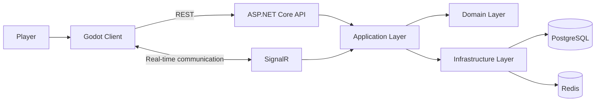
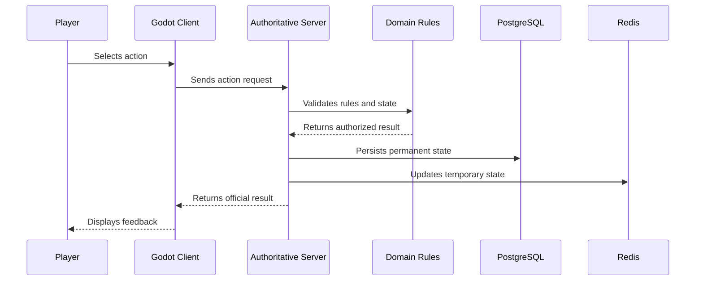

# Fluxograma Geral do Sistema

## Componentes principais

## Regra de autoridade

O cliente envia intenções.

O servidor valida regras, estado, permissões e resultados.

O cliente apresenta somente informações autorizadas pelo servidor.

## Fluxo de uma ação crítica

