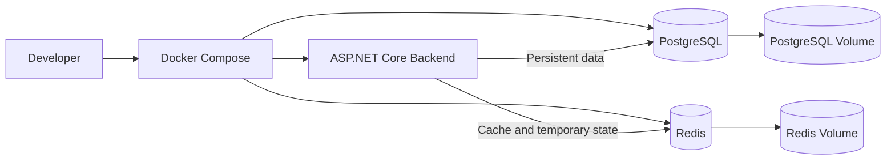
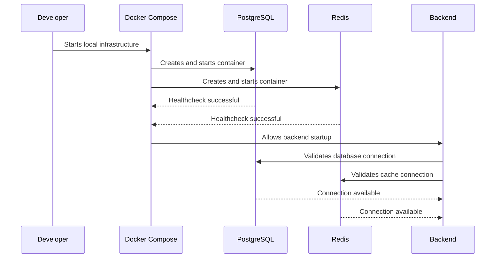

# Fluxo da Infraestrutura Local

## Visão geral

## Inicialização dos serviços

## Regra de inicialização

O backend somente poderá utilizar PostgreSQL e Redis depois que os respectivos healthchecks indicarem que os serviços estão disponíveis.

## Responsabilidades

### PostgreSQL

Armazena dados permanentes, como:

- contas;
- Comandantes;
- Cartas de Invocação;
- inventários;
- progresso;
- economia;
- histórico de transações;
- resultados persistentes.

### Redis

Armazena dados temporários ou de acesso rápido, como:

- sessões;
- cache;
- matchmaking;
- estado temporário de partidas;
- notificações;
- filas;
- ranking de leitura rápida.

### Docker Compose

Responsável por:

- criar os containers;
- configurar a rede interna;
- criar volumes;
- aplicar variáveis de ambiente;
- verificar a saúde dos serviços;
- permitir inicialização reproduzível.