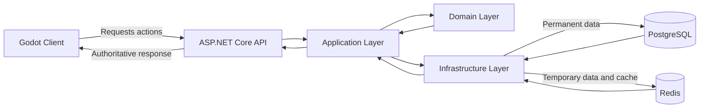
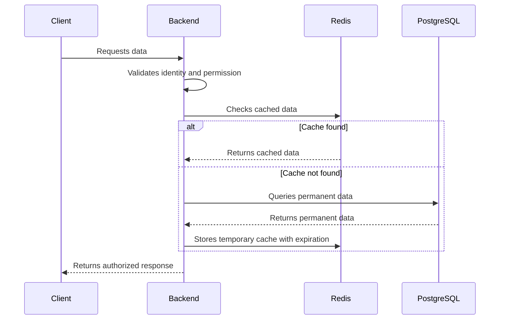
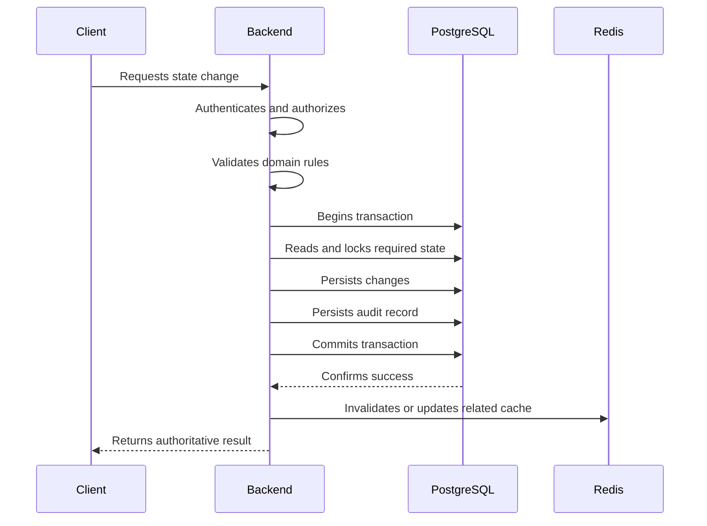
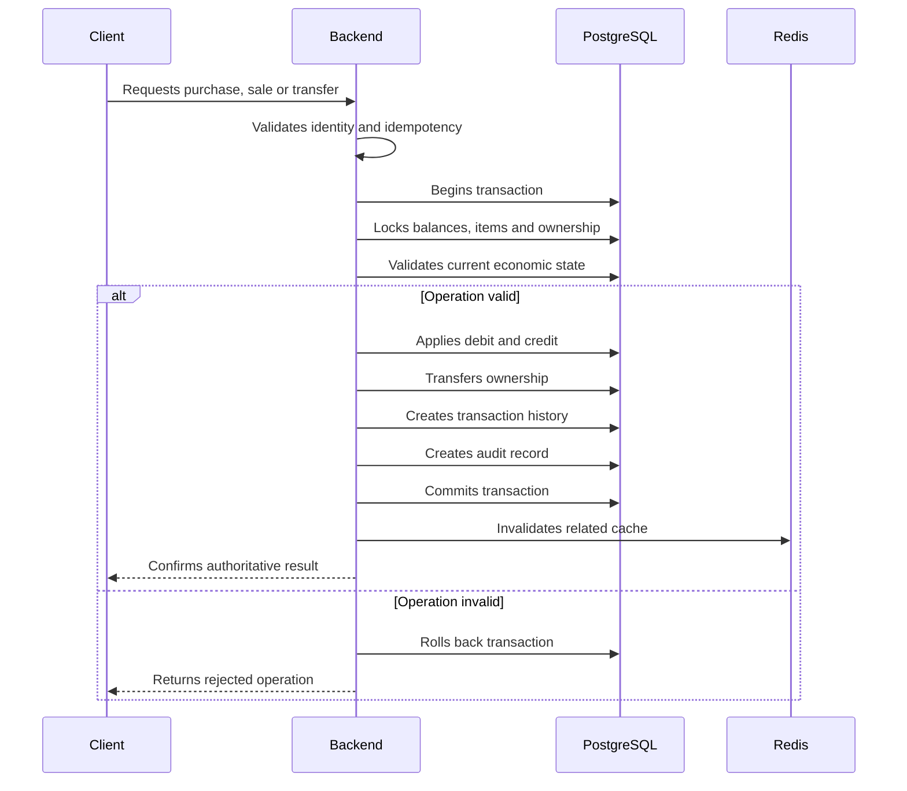
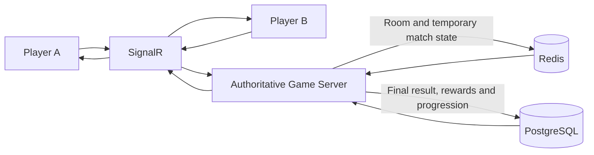
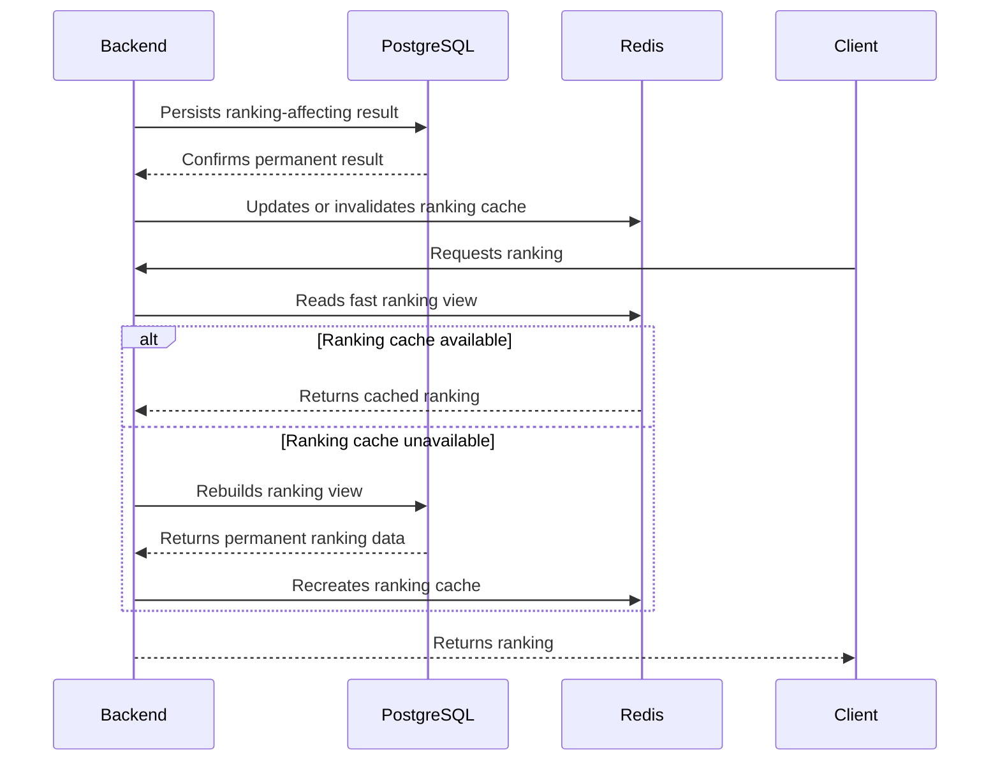
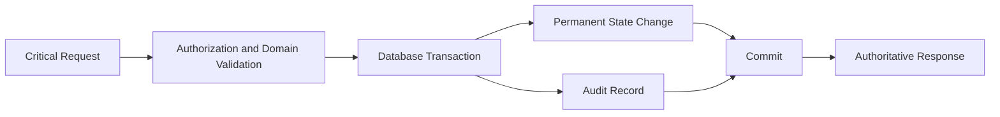

# Fluxo de Persistência

## Objetivo

Definir como o cliente, o backend, o PostgreSQL e o Redis participam das operações de leitura, escrita, economia, partidas e auditoria em Umbra Blackvale.

## Visão geral

## Regra de autoridade

O cliente solicita ações.

O backend valida:

- identidade;
- autorização;
- estado atual;
- regras do domínio;
- disponibilidade dos recursos;
- integridade da operação.

Somente o servidor confirma:

- dano;
- crítico;
- loot;
- experiência;
- recompensas;
- propriedade;
- economia;
- resultados;
- progressão.

## Fluxo de leitura

## Regras do fluxo de leitura

- O cache nunca substitui a fonte permanente.
- Dados sensíveis deverão ser filtrados antes da resposta.
- O jogador somente poderá acessar dados autorizados.
- Dados armazenados no Redis deverão possuir expiração quando aplicável.
- A ausência do Redis não poderá apagar ou invalidar dados permanentes.
- Consultas frequentes deverão ser avaliadas para cache somente quando houver benefício real.

## Fluxo de escrita permanente

## Regras do fluxo de escrita

- Toda alteração permanente deverá passar pelo backend.
- Operações críticas deverão utilizar transação.
- Dados relacionados deverão ser alterados como uma única unidade.
- Falhas antes do commit deverão cancelar toda a operação.
- A resposta ao cliente somente deverá confirmar sucesso após o commit.
- O cache relacionado deverá ser invalidado ou atualizado após a persistência.
- A falha do Redis não poderá desfazer silenciosamente uma operação já confirmada no PostgreSQL.
- Operações repetíveis deverão utilizar mecanismos de idempotência.

## Fluxo econômico

## Regras do fluxo econômico

- Débito, crédito e transferência de propriedade deverão ocorrer na mesma transação.
- Nenhum item poderá possuir dois proprietários simultaneamente.
- Nenhum saldo poderá ser alterado sem histórico correspondente.
- Operações duplicadas deverão ser detectadas.
- Valores monetários não utilizarão ponto flutuante.
- Toda movimentação relevante deverá possuir origem, destino, motivo e data.
- Falhas parciais não poderão gerar duplicação ou perda de patrimônio.

## Fluxo de salas e partidas

## Regras do fluxo de partidas

- Redis poderá armazenar o estado temporário da sala e da partida.
- O servidor continuará sendo responsável pelo cálculo autoritativo.
- O cliente não poderá enviar resultados finais.
- Resultados relevantes deverão ser persistidos no PostgreSQL.
- Recompensas somente serão concedidas após validação do resultado.
- Desconexões não deverão permitir duplicação de recompensas.
- O encerramento da partida deverá possuir uma operação idempotente.
- Estados temporários abandonados deverão possuir expiração.

## Fluxo de ranking

## Fluxo de auditoria

Operações críticas deverão produzir registros de auditoria dentro da mesma transação dos dados alterados sempre que a consistência exigir.

## Tratamento de falhas

### Falha antes do commit

- A transação deverá ser revertida.
- Nenhum resultado de sucesso será enviado ao cliente.
- Nenhuma recompensa será considerada concedida.
- A mesma solicitação poderá ser repetida com segurança quando houver idempotência.

### Falha depois do commit

- O dado permanente continuará válido.
- O sistema não deverá repetir a operação econômica.
- Atualizações de cache ou notificações poderão ser refeitas.
- O backend deverá recuperar o resultado pela chave de idempotência quando aplicável.

### Falha do Redis

- O PostgreSQL continuará sendo a fonte de verdade.
- O cache poderá ser reconstruído.
- Estados temporários poderão expirar.
- O progresso permanente não poderá ser perdido.
- Recursos dependentes do Redis poderão ficar temporariamente indisponíveis sem corromper os dados permanentes.

### Falha do PostgreSQL

- Operações permanentes não serão confirmadas.
- Economia, propriedade, progressão e recompensas deverão permanecer bloqueadas.
- O backend não poderá utilizar o Redis como substituto permanente.
- O cliente receberá uma resposta controlada de indisponibilidade.

## Critério de conclusão

O fluxo de persistência será considerado documentado quando:

1. Leituras diferenciarem cache de fonte permanente.
2. Escritas permanentes utilizarem autoridade do servidor.
3. Operações econômicas utilizarem transações.
4. Auditoria estiver vinculada às operações críticas.
5. Redis puder falhar sem apagar progresso permanente.
6. Resultados de partidas forem persistidos pelo servidor.
7. Operações repetidas não gerarem recompensas ou transações duplicadas.