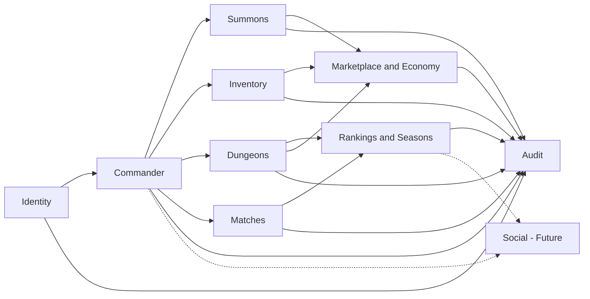
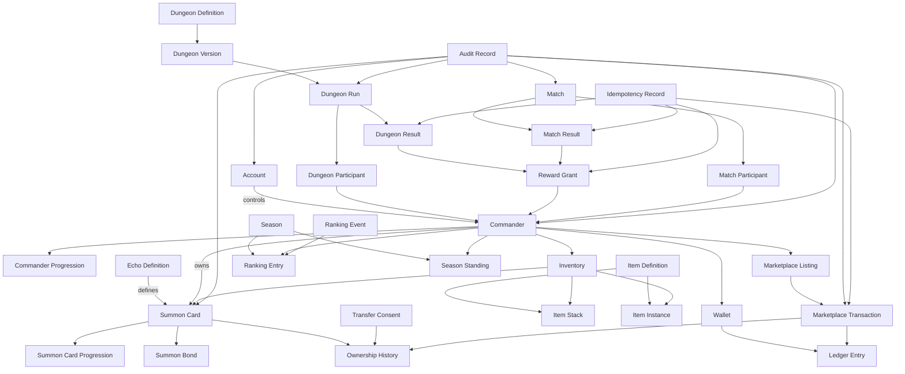

# Modelo Conceitual do Banco de Dados

## Objetivo

Definir os principais domínios, conceitos, responsabilidades e relacionamentos persistentes de Umbra Blackvale antes da criação do modelo lógico, das entidades do Entity Framework Core e das migrations.

Este documento descreve o significado dos dados.

Ele ainda não define:

- nomes físicos de tabelas;
- nomes de colunas;
- tipos de dados;
- chaves estrangeiras físicas;
- índices;
- constraints detalhadas;
- configurações do Entity Framework Core;
- migrations.

## Princípios

O modelo conceitual seguirá estes princípios:

- PostgreSQL será a fonte permanente de verdade.
- Redis armazenará somente dados temporários, derivados ou reconstruíveis.
- O servidor será autoritativo.
- Conta e Comandante serão conceitos separados.
- Conteúdo de catálogo será separado de instâncias pertencentes aos jogadores.
- Definições de Dungeons serão separadas das execuções realizadas.
- Propriedade atual será separada do histórico de propriedade.
- Operações econômicas possuirão histórico imutável.
- Recompensas possuirão origem verificável.
- Resultados de partidas serão confirmados pelo servidor.
- O modelo inicial atenderá ao MVP sem tentar antecipar sistemas ainda indefinidos.

## Contextos principais

## Contexto de identidade

### Account

Representa a identidade técnica utilizada para acessar Umbra Blackvale.

Responsabilidades conceituais:

- autenticação;
- estado da conta;
- permissões;
- segurança;
- bloqueios;
- datas de criação e acesso;
- associação com a identidade jogável;
- medidas administrativas.

A conta não representa diretamente o personagem jogável.

### AccountCredential

Representa a credencial protegida utilizada pela conta.

Poderá conter conceitos como:

- credencial local;
- provedor externo;
- hash protegido;
- data de alteração;
- estado de validade.

Senhas nunca serão armazenadas em texto simples.

### AccountRestriction

Representa restrições administrativas ou de segurança aplicadas à conta.

Exemplos conceituais:

- suspensão;
- bloqueio temporário;
- restrição de mercado;
- restrição de comunicação;
- banimento.

Toda restrição relevante deverá possuir motivo, período e responsável.

### Session

Representa uma sessão temporária autenticada.

A sessão será armazenada prioritariamente no Redis.

A existência de uma sessão não substituirá os dados permanentes da conta.

## Contexto do Comandante

### Commander

Representa a identidade jogável e pública do jogador dentro de Umbra Blackvale.

Responsabilidades conceituais:

- nome público;
- identidade visual;
- fama;
- reputação;
- progressão;
- estado da Marca de Umbra;
- participação em Dungeons;
- participação em partidas;
- posição competitiva;
- propriedade de inventário;
- propriedade de Cartas de Invocação.

A quantidade de Comandantes permitida por conta ainda será definida.

O modelo conceitual preservará a separação entre `Account` e `Commander` para não misturar autenticação com gameplay.

### CommanderProgression

Representa o estado persistente de evolução do Comandante.

Poderá incluir:

- nível;
- experiência;
- fama;
- reputação;
- marcos alcançados;
- progressão competitiva;
- desbloqueios permanentes.

As fórmulas e atributos finais ainda não estão definidos.

### CommanderProfile

Representa as informações públicas do Comandante.

Poderá conter:

- nome de exibição;
- título;
- aparência selecionada;
- emblemas;
- conquistas exibidas;
- mensagem pública.

Dados privados da conta não poderão ser expostos pelo perfil do Comandante.

## Contexto de Invocações

### EchoDefinition

Representa a definição de catálogo de um tipo de Eco ou Invocação.

Responsabilidades conceituais:

- identidade do tipo;
- nome;
- categoria;
- comportamento-base;
- habilidades possíveis;
- características visuais;
- regras de obtenção;
- disponibilidade;
- versão de conteúdo.

Uma definição não pertence a um jogador.

Ela descreve o modelo compartilhado utilizado para criar instâncias individuais.

### SummonCard

Representa uma Carta de Invocação individual existente no mundo do jogo.

Responsabilidades conceituais:

- identidade única;
- definição de origem;
- proprietário atual;
- origem de obtenção;
- raridade;
- evolução;
- estado;
- vínculo;
- restrições de uso;
- restrições de negociação;
- histórico.

Duas Cartas baseadas na mesma definição poderão possuir identidades e progressões diferentes.

### SummonCardProgression

Representa a evolução individual de uma Carta.

Poderá conter:

- nível;
- experiência;
- aprimoramentos;
- habilidades desbloqueadas;
- evolução;
- estado de progressão.

As fórmulas finais serão definidas no módulo de progressão das Invocações.

### SummonBond

Representa o vínculo entre uma Carta e o Comandante.

Poderá registrar:

- tipo de vínculo;
- intensidade;
- estado;
- data de criação;
- restrições resultantes;
- condições de ruptura;
- consequências de transferência.

O vínculo não será tratado apenas como um valor decorativo.

Ele poderá afetar gameplay, transferência e identidade da Invocação.

### SummonCardOrigin

Representa a origem verificável de uma Carta.

Exemplos conceituais:

- recompensa de Dungeon;
- conversão permitida de inimigo;
- evento;
- troca;
- mercado;
- concessão administrativa auditada.

A origem deverá permitir investigar duplicações, fraudes e inconsistências.

### SummonCardOwnershipHistory

Representa o histórico de propriedade de uma Carta.

Deverá preservar:

- proprietário anterior;
- novo proprietário;
- operação responsável;
- data;
- motivo;
- consentimento quando exigido;
- referência econômica relacionada.

O histórico não substituirá a referência ao proprietário atual.

### SummonTransferConsent

Representa o consentimento verificável exigido por determinadas transferências.

Poderá registrar:

- entidade que concedeu o consentimento;
- transferência autorizada;
- condições;
- data;
- expiração;
- revogação quando permitida;
- prova de validade.

O avatar principal de um jogador nunca poderá ser transformado em uma Carta transferível.

## Contexto de inventário

### Inventory

Representa o conjunto de ativos mantidos por um Comandante.

Responsabilidades conceituais:

- armazenar referências aos ativos;
- aplicar limites;
- controlar disponibilidade;
- impedir quantidades inválidas;
- registrar movimentações relevantes.

O inventário poderá conter conceitos diferentes de armazenamento para:

- Cartas de Invocação;
- itens empilháveis;
- equipamentos individualizados;
- materiais;
- consumíveis;
- recursos.

### ItemDefinition

Representa a definição de catálogo de um item.

Responsabilidades conceituais:

- nome;
- categoria;
- propriedades-base;
- regras de uso;
- empilhamento;
- negociação;
- disponibilidade;
- versão.

A definição de item não representa uma unidade pertencente ao jogador.

### ItemStack

Representa uma quantidade de itens empilháveis baseados na mesma definição.

Exemplos possíveis:

- materiais;
- consumíveis comuns;
- recursos sem identidade individual.

A quantidade nunca poderá ser negativa.

### ItemInstance

Representa um item individualizado.

Será utilizado quando o item possuir:

- identidade própria;
- atributos variáveis;
- evolução;
- durabilidade;
- vínculo;
- restrições;
- histórico;
- proprietário individual.

### InventoryMovement

Representa uma movimentação relevante de inventário.

Poderá registrar:

- ativo;
- quantidade;
- origem;
- destino;
- motivo;
- operação;
- data;
- estado.

Movimentações críticas deverão estar relacionadas à operação que as originou.

### DungeonLoadout

Representa a seleção de Cartas e equipamentos preparada para uma Dungeon.

A quantidade disponível no inventário poderá ser maior que a quantidade permitida na execução.

O loadout deverá respeitar as regras da versão da Dungeon utilizada.

## Contexto de grupos e salas

### Party

Representa um grupo de Comandantes organizado para uma atividade.

Responsabilidades conceituais:

- liderança;
- participantes;
- convites;
- estado de preparação;
- atividade pretendida;
- regras de entrada.

Grande parte do estado de uma Party poderá permanecer temporariamente no Redis.

Informações relevantes de uma execução concluída serão preservadas por meio dos participantes da Dungeon ou da partida.

### Room

Representa uma sala temporária utilizada para preparar ou executar uma atividade multiplayer.

Poderá conter:

- participantes;
- estado;
- líder;
- regras;
- atividade associada;
- tempo de expiração.

Salas abandonadas deverão expirar.

O estado temporário da sala não será fonte permanente de recompensas ou resultados.

## Contexto de Dungeons

### DungeonDefinition

Representa a identidade conceitual permanente de uma Dungeon.

Responsabilidades conceituais:

- nome;
- categoria;
- identidade narrativa;
- disponibilidade;
- conjunto de versões.

### DungeonVersion

Representa uma versão específica das regras de uma Dungeon.

Responsabilidades conceituais:

- dificuldade;
- requisitos;
- inimigos;
- chefes;
- regras;
- custos;
- limites;
- recompensas possíveis;
- período de validade;
- temporada relacionada.

Cada execução deverá utilizar uma versão definida.

Alterações futuras na Dungeon não poderão modificar silenciosamente o histórico de execuções antigas.

### DungeonRun

Representa uma execução concreta de uma Dungeon.

Responsabilidades conceituais:

- versão utilizada;
- participantes;
- estado;
- início;
- encerramento;
- resultado;
- dificuldade;
- configuração;
- recompensas concedidas;
- identificador de encerramento idempotente.

### DungeonParticipant

Representa a participação de um Comandante em uma execução.

Poderá preservar:

- Comandante;
- papel;
- loadout;
- estado de entrada;
- estado de conclusão;
- contribuição relevante;
- elegibilidade para recompensa.

### DungeonResult

Representa o resultado autoritativo de uma execução.

Poderá conter:

- sucesso ou falha;
- motivo de encerramento;
- duração;
- chefe derrotado;
- objetivos concluídos;
- pontuação;
- estado de validação.

O cliente nunca poderá definir diretamente o resultado.

### RewardDefinition

Representa uma possibilidade de recompensa configurada no conteúdo.

Ela poderá definir:

- tipo;
- condições;
- faixa;
- peso;
- quantidade possível;
- restrições.

### RewardGrant

Representa uma recompensa efetivamente concedida.

Deverá registrar:

- destinatário;
- origem;
- conteúdo;
- quantidade;
- data;
- operação;
- chave de idempotência;
- estado.

Uma possibilidade de recompensa e uma recompensa concedida são conceitos diferentes.

## Contexto de partidas

### Match

Representa uma partida competitiva ou cooperativa conduzida pelo servidor.

Responsabilidades conceituais:

- participantes;
- configuração;
- temporada;
- estado;
- início;
- encerramento;
- versão das regras;
- resultado autoritativo.

### MatchParticipant

Representa a participação de um Comandante em uma partida.

Poderá registrar:

- Comandante;
- lado ou equipe;
- loadout;
- estado;
- abandono;
- estatísticas relevantes;
- elegibilidade para recompensa.

### MatchResult

Representa o resultado permanente confirmado pelo servidor.

Poderá registrar:

- vencedor;
- perdedor;
- empate quando permitido;
- pontuação;
- motivo de encerramento;
- alterações competitivas;
- recompensas;
- penalidades.

### CombatState

Representa o estado temporário necessário durante um combate em andamento.

Será mantido prioritariamente no Redis ou na memória autoritativa do servidor.

O resultado permanente será persistido no PostgreSQL.

O banco não precisa armazenar cada animação, quadro visual ou efeito executado pelo cliente.

## Contexto de temporadas e ranking

### Season

Representa um período competitivo oficial.

Responsabilidades conceituais:

- identidade;
- nome;
- início;
- encerramento;
- estado;
- regras;
- critérios;
- recompensas;
- versão competitiva.

### RankingEntry

Representa a pontuação persistente de um Comandante em uma temporada e categoria.

Poderá registrar:

- Comandante;
- temporada;
- categoria;
- pontuação;
- posição consolidada;
- última atualização;
- critérios aplicados.

### RankingEvent

Representa um acontecimento autoritativo que alterou a pontuação.

Exemplos:

- vitória;
- derrota;
- Dungeon;
- penalidade;
- correção administrativa;
- evento competitivo.

A pontuação consolidada deverá possuir respaldo em acontecimentos permanentes.

### SeasonStanding

Representa a classificação final de uma temporada encerrada.

Deverá preservar:

- posição final;
- pontuação final;
- categoria;
- critérios;
- recompensa;
- data de consolidação.

Uma temporada encerrada não poderá ser alterada silenciosamente.

## Contexto econômico

### CurrencyDefinition

Representa uma moeda reconhecida pelo sistema.

Responsabilidades conceituais:

- identidade;
- nome;
- finalidade;
- regras de obtenção;
- regras de uso;
- possibilidade de negociação;
- estado.

As moedas oficiais ainda serão definidas.

### Wallet

Representa os saldos econômicos de um Comandante ou conta, conforme a regra futura.

O saldo atual será uma visão controlada do estado econômico.

Ele não substituirá o histórico de movimentações.

### LedgerEntry

Representa uma movimentação econômica imutável.

Poderá registrar:

- moeda;
- valor;
- direção;
- origem;
- destino;
- motivo;
- operação;
- saldo relacionado;
- data;
- correlação.

Nenhum saldo poderá ser alterado sem movimentação correspondente.

### MarketplaceListing

Representa um anúncio criado no mercado.

Responsabilidades conceituais:

- vendedor;
- ativo anunciado;
- preço;
- moeda;
- quantidade;
- condições;
- início;
- expiração;
- estado.

### MarketplaceTransaction

Representa a conclusão de uma operação do mercado.

Deverá relacionar:

- comprador;
- vendedor;
- anúncio;
- ativo;
- pagamento;
- taxas;
- transferência de propriedade;
- data;
- estado;
- idempotência.

Pagamento e transferência deverão ocorrer na mesma transação de banco.

### DirectTrade

Representa uma negociação direta entre jogadores.

As regras completas de troca direta ainda serão definidas.

Quando implementada, deverá garantir atomicidade entre todos os ativos envolvidos.

### EconomicCompensation

Representa uma compensação concedida por operação administrativa controlada.

Deverá possuir:

- destinatário;
- motivo;
- responsável;
- conteúdo;
- data;
- auditoria;
- idempotência.

Compensações não poderão ser utilizadas como atalho silencioso para corrigir inconsistências.

## Contexto de auditoria

### AuditRecord

Representa o registro imutável de uma operação crítica.

Poderá conter:

- responsável;
- tipo de operação;
- entidade afetada;
- identificador;
- estado anterior relevante;
- estado posterior relevante;
- motivo;
- data;
- origem;
- correlação;
- resultado.

### IdempotencyRecord

Representa uma solicitação crítica que deve produzir apenas um resultado.

Responsabilidades conceituais:

- identificar a operação;
- identificar o solicitante;
- armazenar o estado;
- preservar o resultado;
- impedir repetição dos efeitos;
- permitir recuperação segura da resposta.

### AdministrativeAction

Representa uma ação administrativa que altera dados do jogo.

Deverá possuir:

- administrador responsável;
- permissão utilizada;
- motivo;
- alvo;
- alteração;
- data;
- auditoria.

## Relacionamentos conceituais

## Limites dos agregados

### Account Aggregate

Responsável por:

- identidade;
- credenciais;
- estado;
- segurança;
- restrições.

Não deverá alterar diretamente progressão, inventário ou economia.

### Commander Aggregate

Responsável por:

- identidade jogável;
- perfil;
- progressão;
- estado permanente do Comandante.

Não deverá incorporar internamente todo o inventário, todas as Cartas e todo o histórico competitivo como uma única estrutura carregada.

### Summon Card Aggregate

Responsável por:

- identidade da Carta;
- estado;
- progressão;
- vínculo;
- proprietário atual;
- regras próprias.

Transferências econômicas dependerão também do contexto de economia.

### Inventory Aggregate

Responsável por:

- disponibilidade dos ativos;
- quantidades;
- limites;
- movimentações internas.

Ele não será responsável por decidir sozinho recompensas ou transações de mercado.

### Dungeon Run Aggregate

Responsável por:

- execução;
- participantes;
- estado;
- resultado;
- encerramento.

A concessão final de recompensas será coordenada por um serviço de aplicação transacional.

### Match Aggregate

Responsável por:

- configuração;
- participantes;
- estado;
- resultado;
- encerramento idempotente.

### Season Aggregate

Responsável por:

- período;
- regras competitivas;
- encerramento;
- classificação final.

### Economy Aggregate

Responsável por:

- anúncios;
- pagamentos;
- movimentações;
- propriedade;
- taxas;
- transações.

Operações econômicas envolverão transações de banco e auditoria.

## Separação entre catálogo e propriedade

Estes conceitos são de catálogo:

- `EchoDefinition`;
- `ItemDefinition`;
- `DungeonDefinition`;
- `DungeonVersion`;
- `RewardDefinition`;
- `CurrencyDefinition`.

Estes conceitos representam instâncias ou propriedade:

- `SummonCard`;
- `ItemInstance`;
- `ItemStack`;
- `Inventory`;
- `Wallet`;
- `MarketplaceListing`.

Uma alteração de catálogo não poderá modificar silenciosamente o histórico de uma instância já utilizada.

Quando necessário, a instância ou execução preservará a versão de conteúdo utilizada.

## Separação entre estado temporário e permanente

### Estado temporário

Poderá permanecer no Redis:

- sessões;
- presença;
- matchmaking;
- convites;
- salas em preparação;
- combate em andamento;
- notificações;
- ranking de leitura rápida;
- locks distribuídos.

### Estado permanente

Deverá permanecer no PostgreSQL:

- conta;
- Comandante;
- progresso;
- inventário;
- propriedade;
- Cartas;
- resultados;
- recompensas;
- ranking consolidado;
- temporada;
- economia;
- histórico;
- auditoria.

## Modelo inicial do MVP

O MVP deverá persistir inicialmente os conceitos necessários para:

- autenticação;
- conta;
- Comandante;
- perfil;
- progressão básica;
- definições de Invocações;
- Cartas individuais;
- inventário;
- definições de Dungeons;
- execuções de Dungeons;
- participantes;
- resultados;
- recompensas;
- temporadas;
- ranking;
- mercado;
- movimentações econômicas;
- auditoria;
- idempotência.

Sistemas futuros não entrarão no primeiro modelo apenas porque poderão existir algum dia.

## Sistemas fora do primeiro modelo físico

Permanecem fora do primeiro modelo físico até documentação específica:

- guildas;
- guerras de guildas;
- continentes completos;
- facções definitivas;
- habitação;
- criação de itens;
- sistema social completo;
- feed público completo;
- relacionamentos entre jogadores;
- eventos mundiais;
- múltiplas regiões de servidor;
- migração entre servidores;
- sistema completo de chat;
- leilões avançados;
- sistema completo de clãs;
- torneios especiais.

## Decisões pendentes

Ainda deverão ser definidos:

- quantidade de Comandantes por conta;
- possibilidade de múltiplos perfis;
- atributos finais do Comandante;
- atributos finais das Cartas;
- tipos de vínculo;
- regras de consentimento;
- raridades;
- evolução;
- limites de inventário;
- limite de Cartas por Dungeon;
- custo de substituição durante Dungeons;
- moedas oficiais;
- propriedade da carteira pela conta ou pelo Comandante;
- regras completas de mercado;
- regras de troca direta;
- fórmulas de ranking;
- categorias de ranking;
- política de temporadas;
- requisitos de retenção histórica.

Essas decisões não serão inventadas durante a criação das entidades.

## Critério de conclusão

O modelo conceitual será considerado concluído quando:

1. Conta e Comandante estiverem separados.
2. Catálogo e instâncias pertencentes aos jogadores estiverem separados.
3. Definições e execuções de Dungeons estiverem separadas.
4. Propriedade atual e histórico estiverem separados.
5. Recompensas possuírem origem identificável.
6. Economia possuir carteira, histórico e transações.
7. Ranking possuir temporada e respaldo persistente.
8. Auditoria e idempotência estiverem representadas.
9. Redis estiver limitado a estados temporários ou derivados.
10. Decisões ainda pendentes permanecerem fora do modelo físico.
