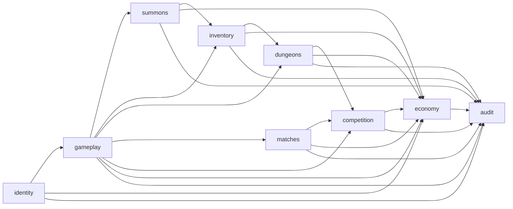

# Visão Geral do Modelo Lógico

## Status

Modelo lógico inicial do MVP.

Este documento define a organização das tabelas e suas dependências gerais.

Os campos, constraints e índices detalhados serão definidos nos documentos específicos de cada domínio antes da criação das entidades do Entity Framework Core ou das migrations.

## Objetivo

Transformar o modelo conceitual aprovado em uma estrutura lógica organizada, permitindo:

- identificar as tabelas do MVP;
- separar responsabilidades por schema;
- definir dependências entre domínios;
- impedir relacionamentos circulares desnecessários;
- planejar a ordem das migrations;
- evitar que sistemas futuros sejam antecipados sem necessidade.

## Princípios aplicados

- PostgreSQL será a fonte permanente de verdade.
- Redis continuará limitado a dados temporários ou reconstruíveis.
- O servidor será autoritativo.
- Uma Account possuirá inicialmente um Commander.
- Uma Account possuirá uma Wallet.
- Um Commander possuirá um Inventory.
- Summon Cards pertencerão ao Commander.
- Ranking pertencerá ao Commander.
- Histórico e estado atual serão armazenados separadamente.
- Catálogo e instâncias pertencentes aos jogadores serão armazenados separadamente.
- Operações econômicas serão transacionais e auditáveis.
- Resultados de Dungeons e Matches serão confirmados pelo servidor.
- Guildas, leilões, trocas diretas e múltiplos Commanders permanecerão fora do primeiro modelo físico.

## Schemas iniciais

O banco será dividido nos seguintes schemas:

| Schema | Responsabilidade |
|---|---|
| `identity` | Contas, credenciais e restrições |
| `gameplay` | Commanders, perfis e progressão |
| `summons` | Definições, instâncias, vínculos e propriedade de Summon Cards |
| `inventory` | Inventários, itens e movimentações |
| `dungeons` | Definições, versões, execuções, resultados e recompensas |
| `matches` | Partidas, participantes e resultados |
| `competition` | Temporadas e ranking |
| `economy` | Wallets, moedas, movimentações e Marketplace |
| `audit` | Auditoria, idempotência e ações administrativas |

## Schema identity

### `identity.accounts`

Representa a identidade técnica do usuário.

Responsabilidades:

- autenticação;
- estado da conta;
- segurança;
- permissões;
- criação e acesso;
- bloqueios gerais.

### `identity.account_credentials`

Representa os métodos de autenticação associados a uma Account.

Uma Account poderá possuir várias credenciais.

Exemplos futuros:

- autenticação local;
- provedor externo;
- recuperação de acesso.

### `identity.account_restrictions`

Representa restrições administrativas ou de segurança aplicadas à Account.

Exemplos:

- suspensão;
- banimento;
- restrição temporária;
- bloqueio de Marketplace.

## Schema gameplay

### `gameplay.commanders`

Representa a identidade jogável e pública.

No MVP, cada Account possuirá exatamente um Commander.

### `gameplay.commander_profiles`

Representa as informações públicas exibidas aos outros jogadores.

Exemplos:

- nome público;
- título;
- aparência selecionada;
- apresentação pública.

### `gameplay.commander_progressions`

Representa a progressão permanente do Commander.

Poderá armazenar:

- nível;
- experiência;
- fama;
- reputação;
- marcos permanentes.

As fórmulas finais serão definidas em documentação própria.

## Schema summons

### `summons.echo_definitions`

Representa o catálogo de tipos de Echoes e Summons.

Uma definição não pertence a nenhum jogador.

### `summons.summon_cards`

Representa cada Summon Card individual existente no jogo.

Cada registro possuirá:

- identidade própria;
- definição de origem;
- proprietário atual;
- estado persistente.

### `summons.summon_card_progressions`

Representa a progressão individual de uma Summon Card.

### `summons.summon_bonds`

Representa o vínculo persistente entre uma Summon Card e seu Commander.

### `summons.summon_transfer_consents`

Representa consentimentos verificáveis exigidos por determinadas transferências.

### `summons.summon_card_ownership_history`

Representa o histórico imutável de propriedade de cada Summon Card.

O proprietário atual permanecerá registrado em `summon_cards`.

O histórico não será utilizado como única forma de descobrir o proprietário atual.

## Schema inventory

### `inventory.inventories`

Representa o Inventory único de cada Commander.

### `inventory.item_definitions`

Representa o catálogo compartilhado de itens.

### `inventory.item_stacks`

Representa quantidades de itens empilháveis.

### `inventory.item_instances`

Representa itens individualizados.

Será utilizado quando um item possuir:

- identidade própria;
- atributos variáveis;
- evolução;
- durabilidade;
- vínculo;
- histórico.

### `inventory.inventory_movements`

Representa movimentações relevantes de entrada, saída ou consumo de ativos.

### `inventory.dungeon_loadouts`

Representa uma configuração preparada por um Commander para uma Dungeon.

### `inventory.dungeon_loadout_entries`

Representa cada Summon Card, equipamento ou item selecionado em um Dungeon Loadout.

## Schema dungeons

### `dungeons.dungeon_definitions`

Representa a identidade permanente de uma Dungeon.

### `dungeons.dungeon_versions`

Representa uma versão específica das regras e do conteúdo de uma Dungeon.

Cada Dungeon Run deverá referenciar uma versão.

### `dungeons.dungeon_runs`

Representa uma execução concreta de Dungeon.

### `dungeons.dungeon_participants`

Representa os Commanders participantes de uma Dungeon Run.

Também preservará snapshot histórico mínimo.

### `dungeons.dungeon_results`

Representa o resultado autoritativo de uma Dungeon Run.

### `dungeons.reward_definitions`

Representa possibilidades de recompensa configuradas no conteúdo.

### `dungeons.reward_grants`

Representa recompensas efetivamente concedidas.

Cada concessão deverá possuir origem e chave de idempotência.

## Schema matches

### `matches.matches`

Representa uma partida criada e conduzida pelo servidor.

### `matches.match_participants`

Representa os Commanders participantes da partida.

Também preservará snapshot histórico mínimo.

### `matches.match_results`

Representa o resultado permanente confirmado pelo servidor.

## Schema competition

### `competition.seasons`

Representa uma temporada competitiva.

### `competition.ranking_entries`

Representa a pontuação consolidada de um Commander dentro de uma temporada e categoria.

### `competition.ranking_events`

Representa acontecimentos autoritativos que alteraram a pontuação.

### `competition.season_standings`

Representa a classificação final preservada após o encerramento de uma temporada.

## Schema economy

### `economy.currency_definitions`

Representa as moedas reconhecidas pelo sistema.

As moedas oficiais ainda serão definidas.

### `economy.wallets`

Representa a Wallet única de cada Account.

### `economy.wallet_balances`

Representa o saldo atual de cada moeda dentro de uma Wallet.

Uma Wallet poderá possuir vários saldos, um por Currency Definition.

### `economy.ledger_entries`

Representa movimentações econômicas imutáveis.

Nenhum saldo será alterado sem movimentação correspondente.

### `economy.marketplace_listings`

Representa anúncios de preço fixo criados pelos jogadores.

### `economy.marketplace_transactions`

Representa compras concluídas no Marketplace.

Pagamento e transferência de propriedade deverão ocorrer dentro da mesma transação de banco.

### `economy.economic_compensations`

Representa compensações administrativas controladas e auditadas.

## Schema audit

### `audit.audit_records`

Representa registros imutáveis de operações críticas.

### `audit.idempotency_records`

Representa operações que não poderão produzir efeitos duplicados.

### `audit.administrative_actions`

Representa ações administrativas que alteraram dados do jogo.

## Relacionamentos principais

```mermaid
erDiagram
    ACCOUNTS ||--|| COMMANDERS : controls
    ACCOUNTS ||--o{ ACCOUNT_CREDENTIALS : authenticates_with
    ACCOUNTS ||--o{ ACCOUNT_RESTRICTIONS : receives
    ACCOUNTS ||--|| WALLETS : owns

    COMMANDERS ||--|| COMMANDER_PROFILES : has
    COMMANDERS ||--|| COMMANDER_PROGRESSIONS : progresses
    COMMANDERS ||--|| INVENTORIES : owns
    COMMANDERS ||--o{ SUMMON_CARDS : owns
    COMMANDERS ||--o{ DUNGEON_PARTICIPANTS : participates
    COMMANDERS ||--o{ MATCH_PARTICIPANTS : participates
    COMMANDERS ||--o{ RANKING_ENTRIES : receives

    ECHO_DEFINITIONS ||--o{ SUMMON_CARDS : defines
    SUMMON_CARDS ||--|| SUMMON_CARD_PROGRESSIONS : progresses
    SUMMON_CARDS ||--o| SUMMON_BONDS : may_have
    SUMMON_CARDS ||--o{ SUMMON_CARD_OWNERSHIP_HISTORY : records

    INVENTORIES ||--o{ ITEM_STACKS : contains
    INVENTORIES ||--o{ ITEM_INSTANCES : contains
    ITEM_DEFINITIONS ||--o{ ITEM_STACKS : defines
    ITEM_DEFINITIONS ||--o{ ITEM_INSTANCES : defines

    DUNGEON_DEFINITIONS ||--o{ DUNGEON_VERSIONS : versions
    DUNGEON_VERSIONS ||--o{ DUNGEON_RUNS : executes
    DUNGEON_RUNS ||--o{ DUNGEON_PARTICIPANTS : includes
    DUNGEON_RUNS ||--o| DUNGEON_RESULTS : produces
    DUNGEON_RESULTS ||--o{ REWARD_GRANTS : grants

    MATCHES ||--o{ MATCH_PARTICIPANTS : includes
    MATCHES ||--o| MATCH_RESULTS : produces
    MATCH_RESULTS ||--o{ REWARD_GRANTS : grants

    SEASONS ||--o{ RANKING_ENTRIES : contains
    SEASONS ||--o{ SEASON_STANDINGS : closes_with
    RANKING_ENTRIES ||--o{ RANKING_EVENTS : receives

    WALLETS ||--o{ WALLET_BALANCES : contains
    CURRENCY_DEFINITIONS ||--o{ WALLET_BALANCES : identifies
    WALLETS ||--o{ LEDGER_ENTRIES : records

    MARKETPLACE_LISTINGS ||--o| MARKETPLACE_TRANSACTIONS : completes
    MARKETPLACE_TRANSACTIONS ||--o{ LEDGER_ENTRIES : generates
```

## Dependências entre schemas

## Ordem inicial de implementação

A ordem prevista para documentação detalhada e implementação será:

1. `identity`;
2. `gameplay`;
3. `audit` básico e idempotência;
4. `summons`;
5. `inventory`;
6. `dungeons`;
7. `matches`;
8. `competition`;
9. `economy`;
10. integração completa da auditoria.

O schema `audit` começa cedo porque identidade e operações críticas já precisarão de rastreabilidade.

Sua integração completa ocorrerá conforme os outros domínios forem implementados.

## Sistemas fora deste modelo

Não fazem parte do primeiro modelo lógico:

- guildas;
- guerras de guildas;
- chat persistente;
- rede social completa;
- leilões;
- trocas diretas;
- habitação;
- crafting;
- múltiplos Commanders;
- eventos mundiais;
- múltiplas regiões de servidor.

Esses sistemas exigirão documentação própria antes de alterar o banco.

## Próximos documentos

O modelo lógico será detalhado por domínio:

1. Identity e Gameplay.
2. Summons e Inventory.
3. Dungeons e Matches.
4. Competition, Economy e Audit.
5. Convenções do Entity Framework Core.
6. Estratégia de migrations.
7. Plano de testes do banco.

## Critério de conclusão

A visão geral estará concluída quando:

1. todos os schemas iniciais estiverem identificados;
2. as tabelas previstas para o MVP estiverem listadas;
3. os relacionamentos principais estiverem documentados;
4. dependências entre domínios estiverem claras;
5. a ordem de implementação estiver definida;
6. sistemas futuros permanecerem fora do primeiro modelo.
