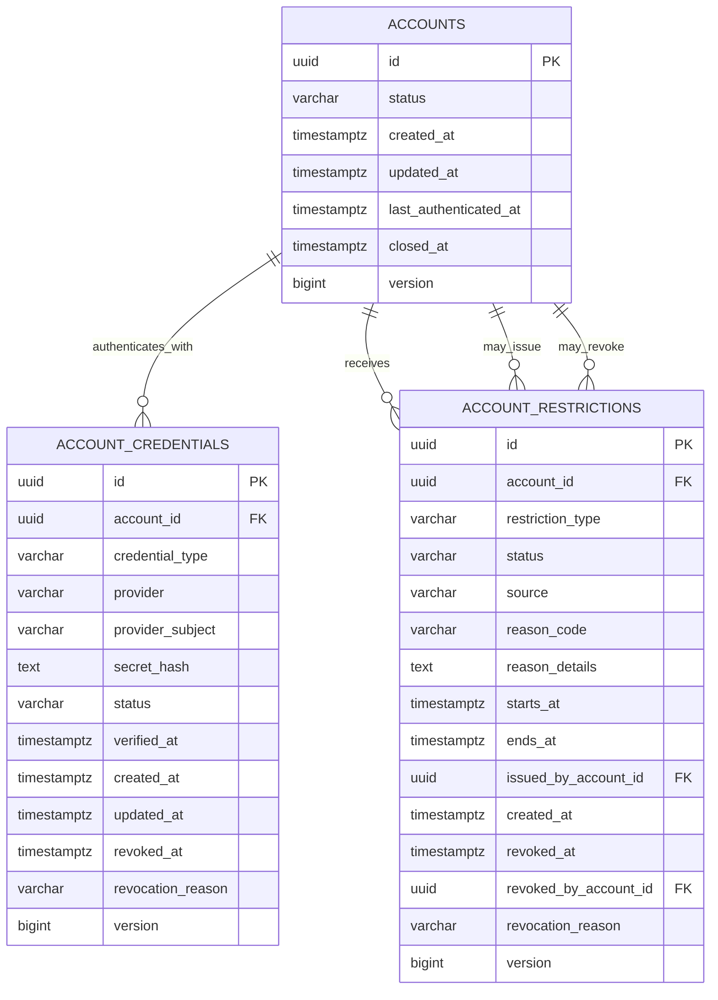
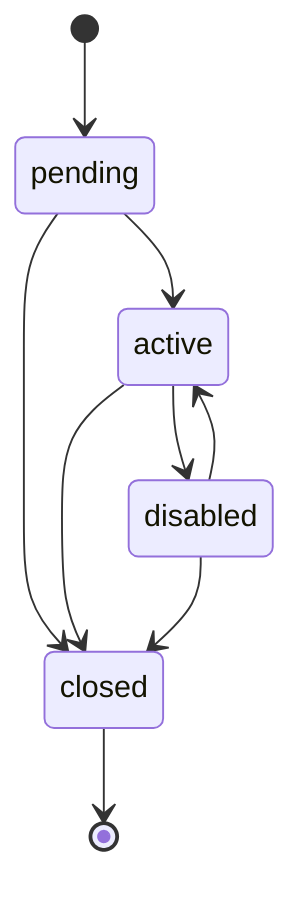
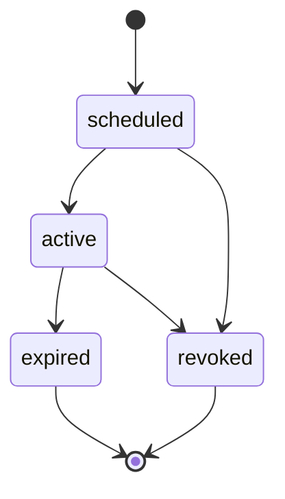
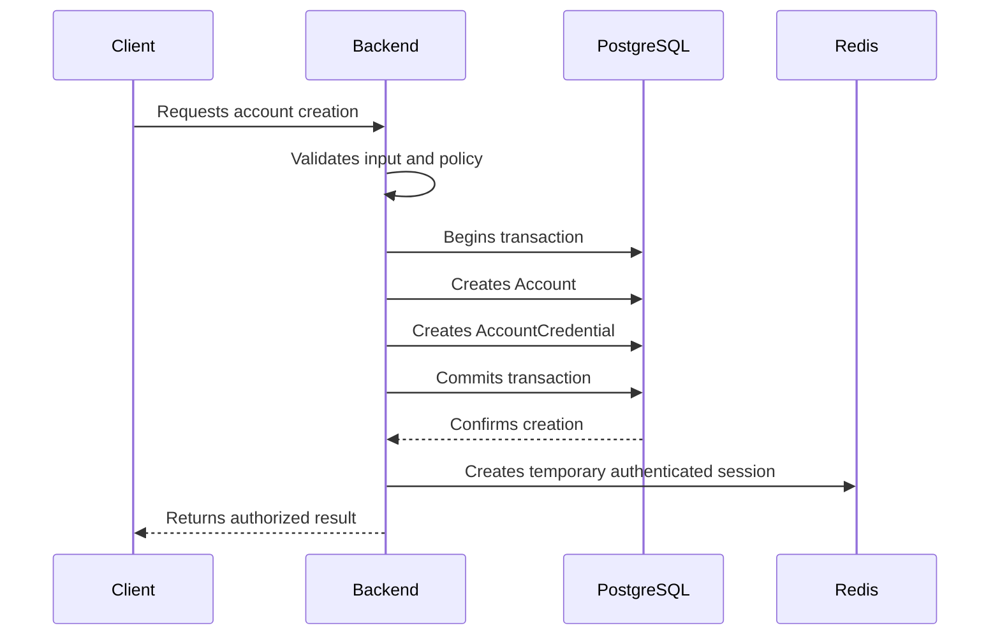
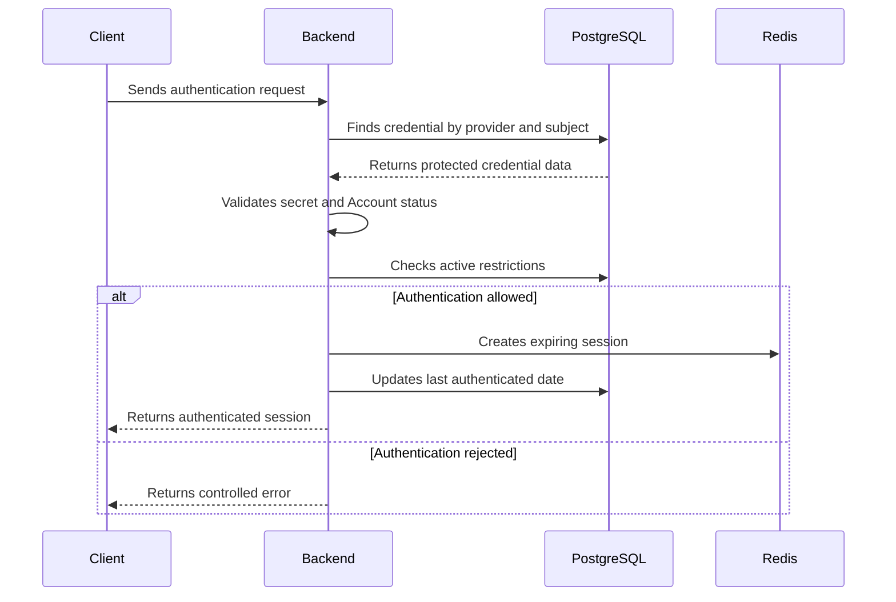
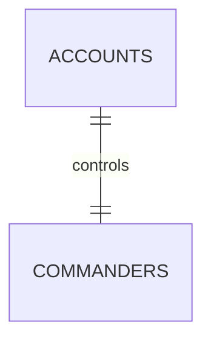

# Modelo Lógico do Domínio Identity

## Status

Modelo lógico inicial do MVP.

Este documento detalha o schema `identity` antes da criação das entidades do Entity Framework Core e das migrations.

As regras poderão ser revisadas antes da primeira migration compartilhada.

## Objetivo

O domínio Identity será responsável por:

- identidade técnica do usuário;
- autenticação;
- credenciais;
- estado da Account;
- restrições administrativas e de segurança;
- vínculo futuro com sessões temporárias;
- proteção dos dados privados de acesso.

O domínio Identity não será responsável por:

- perfil público do Commander;
- progressão;
- inventário;
- Cartas de Invocação;
- ranking;
- economia;
- resultados de gameplay.

## Princípios

- Uma `Account` representa o acesso técnico ao produto.
- Um `Commander` representa a identidade jogável.
- Account e Commander permanecerão separados.
- No MVP, uma Account possuirá exatamente um Commander.
- A referência entre eles será criada pelo schema `gameplay`.
- Uma Account poderá possuir várias credenciais.
- Credenciais nunca armazenarão senhas em texto simples.
- Sessões serão temporárias e mantidas prioritariamente no Redis.
- Conhecer um identificador não concede autorização.
- Restrições relevantes possuirão motivo, período e origem.
- Dados históricos não serão apagados por exclusão em cascata.

## Schema

```text
identity
```

## Tabelas iniciais

O primeiro modelo físico possuirá:

- `identity.accounts`;
- `identity.account_credentials`;
- `identity.account_restrictions`.

Não serão criadas inicialmente:

- tabelas de sessões permanentes;
- tabelas de perfil público;
- tabelas de progressão;
- tabelas de permissões genéricas;
- tabelas de provedores externos ainda não utilizados;
- tabelas de tokens sem uma estratégia de autenticação documentada.

## Diagrama lógico



# identity.accounts

## Responsabilidade

Representa a identidade técnica utilizada para acessar Umbra Blackvale.

Ela não representa diretamente o Commander exibido no mundo do jogo.

## Colunas

| Coluna | Tipo lógico | Obrigatória | Regra |
|---|---|---:|---|
| `id` | UUID | Sim | Chave primária gerada pelo backend |
| `status` | Texto limitado | Sim | Estado atual da Account |
| `created_at` | Data UTC | Sim | Data de criação |
| `updated_at` | Data UTC | Sim | Última alteração |
| `last_authenticated_at` | Data UTC | Não | Última autenticação concluída |
| `closed_at` | Data UTC | Não | Data de encerramento definitivo |
| `version` | Inteiro crescente | Sim | Concorrência otimista |

## Estados iniciais

O campo `status` aceitará inicialmente:

- `pending`;
- `active`;
- `disabled`;
- `closed`.

### pending

A Account foi criada, mas ainda não está liberada para uso normal.

O motivo exato poderá depender da futura estratégia de ativação e verificação.

### active

A Account está autorizada a utilizar o produto, respeitando suas restrições específicas.

### disabled

A Account está temporariamente desativada.

Esse estado poderá ser revertido por operação autorizada.

### closed

A Account foi encerrada.

O encerramento não causará exclusão automática dos históricos relacionados.

## Transições permitidas



O backend deverá impedir transições não documentadas.

## Constraints

### Chave primária

```text
pk_accounts
```

### Status permitido

```text
ck_accounts_status
```

### Encerramento

Quando `status` for `closed`, `closed_at` deverá possuir valor.

Quando `status` não for `closed`, `closed_at` deverá permanecer nulo.

### Versão

`version` deverá ser maior que zero.

## Índices

```text
ix_accounts_status
ix_accounts_created_at
```

Não será criado índice para cada coluna apenas para ornamentar o banco com estruturas que custam escrita e ninguém usa.

## Exclusão

Accounts não serão removidas fisicamente por fluxos normais.

Encerramento será representado por `status = closed`.

Políticas legais de anonimização e retenção serão documentadas antes da operação comercial.

# identity.account_credentials

## Responsabilidade

Representa um método de autenticação associado a uma Account.

Uma Account poderá possuir várias credenciais.

Isso permitirá evolução futura sem transformar a Account em depósito de detalhes específicos de autenticação.

## Colunas

| Coluna | Tipo lógico | Obrigatória | Regra |
|---|---|---:|---|
| `id` | UUID | Sim | Chave primária |
| `account_id` | UUID | Sim | Account proprietária |
| `credential_type` | Texto limitado | Sim | Tipo da credencial |
| `provider` | Texto limitado | Sim | Provedor responsável |
| `provider_subject` | Texto limitado | Sim | Identificador normalizado no provedor |
| `secret_hash` | Texto protegido | Condicional | Hash de segredo local |
| `status` | Texto limitado | Sim | Estado da credencial |
| `verified_at` | Data UTC | Não | Data de verificação |
| `created_at` | Data UTC | Sim | Data de criação |
| `updated_at` | Data UTC | Sim | Última alteração |
| `revoked_at` | Data UTC | Não | Data de revogação |
| `revocation_reason` | Texto limitado | Não | Motivo da revogação |
| `version` | Inteiro crescente | Sim | Concorrência otimista |

## Tipos iniciais

O campo `credential_type` aceitará inicialmente:

- `password`;
- `external`.

O MVP poderá iniciar apenas com `password`.

O valor `external` preserva o modelo para provedores futuros, mas não implementa integração externa por antecipação.

## Provider

Para credenciais locais:

```text
local
```

Provedores externos somente poderão ser adicionados depois de documentação e integração próprias.

## Provider subject

`provider_subject` representa o identificador normalizado reconhecido pelo provedor.

Para autenticação local, ele poderá futuramente representar:

- e-mail normalizado;
- nome de acesso normalizado;
- outro identificador aprovado.

A escolha definitiva do identificador de login ainda deverá ser documentada.

O modelo não fixará silenciosamente essa decisão dentro da migration.

## Secret hash

`secret_hash` será obrigatório quando:

```text
credential_type = password
```

`secret_hash` deverá permanecer nulo quando:

```text
credential_type = external
```

A definição do algoritmo de hash, parâmetros e política de atualização pertencerá ao documento de segurança da autenticação.

O banco jamais receberá senha em texto simples como dado permanente.

## Estados iniciais

O campo `status` aceitará:

- `active`;
- `revoked`.

Uma credencial revogada não poderá autenticar novamente.

## Constraints

### Chave primária

```text
pk_account_credentials
```

### Relacionamento com Account

```text
fk_account_credentials_accounts
```

Comportamento de exclusão:

```text
RESTRICT
```

### Identidade única no provedor

```text
ux_account_credentials_provider_subject
```

Composição:

```text
provider
provider_subject
```

Uma identidade externa ou local não poderá estar vinculada simultaneamente a duas Accounts.

### Tipo permitido

```text
ck_account_credentials_type
```

### Status permitido

```text
ck_account_credentials_status
```

### Segredo obrigatório

```text
ck_account_credentials_secret
```

A constraint deverá garantir:

- credencial `password` exige `secret_hash`;
- credencial `external` não armazena `secret_hash`.

### Revogação

Quando `status` for `revoked`:

- `revoked_at` será obrigatório;
- `revocation_reason` será obrigatório.

## Índices

```text
ix_account_credentials_account_id
ix_account_credentials_account_id_status
```

O índice único de `provider` e `provider_subject` também atenderá à busca de autenticação.

## Dados proibidos

Não serão armazenados nesta tabela:

- senha em texto simples;
- token de sessão;
- refresh token sem proteção;
- código temporário de recuperação já utilizado;
- segredo de provedor externo em texto simples;
- histórico completo de tentativas de login.

Eventos de segurança e auditoria possuirão modelos próprios.

# identity.account_restrictions

## Responsabilidade

Representa uma restrição administrativa ou de segurança aplicada à Account.

Uma restrição poderá afetar áreas específicas sem obrigar o encerramento total da Account.

## Exemplos conceituais

- suspensão de acesso;
- bloqueio de Marketplace;
- bloqueio de comunicação;
- bloqueio competitivo;
- restrição temporária por segurança;
- banimento.

A lista final de tipos deverá ser definida juntamente com as políticas administrativas e de moderação.

## Colunas

| Coluna | Tipo lógico | Obrigatória | Regra |
|---|---|---:|---|
| `id` | UUID | Sim | Chave primária |
| `account_id` | UUID | Sim | Account afetada |
| `restriction_type` | Texto limitado | Sim | Tipo da restrição |
| `status` | Texto limitado | Sim | Estado da restrição |
| `source` | Texto limitado | Sim | Origem da decisão |
| `reason_code` | Texto limitado | Sim | Código estável do motivo |
| `reason_details` | Texto limitado | Não | Explicação administrativa |
| `starts_at` | Data UTC | Sim | Início da vigência |
| `ends_at` | Data UTC | Não | Encerramento previsto |
| `issued_by_account_id` | UUID | Não | Account administrativa responsável |
| `created_at` | Data UTC | Sim | Data do registro |
| `revoked_at` | Data UTC | Não | Data da revogação |
| `revoked_by_account_id` | UUID | Não | Responsável pela revogação |
| `revocation_reason` | Texto limitado | Não | Motivo da revogação |
| `version` | Inteiro crescente | Sim | Concorrência otimista |

## Estados iniciais

O campo `status` aceitará:

- `scheduled`;
- `active`;
- `expired`;
- `revoked`.

## Origens iniciais

O campo `source` aceitará:

- `system`;
- `administrator`.

Quando `source` for `administrator`, `issued_by_account_id` será obrigatório.

Quando `source` for `system`, `issued_by_account_id` poderá permanecer nulo.

## Ciclo de vida



Restrições com início imediato poderão ser criadas diretamente como `active`.

## Constraints

### Chave primária

```text
pk_account_restrictions
```

### Account afetada

```text
fk_account_restrictions_accounts
```

Comportamento:

```text
RESTRICT
```

### Responsável pela emissão

```text
fk_account_restrictions_issued_by_accounts
```

### Responsável pela revogação

```text
fk_account_restrictions_revoked_by_accounts
```

### Período válido

```text
ck_account_restrictions_period
```

Quando `ends_at` possuir valor, ele deverá ser posterior a `starts_at`.

### Origem válida

```text
ck_account_restrictions_source
```

### Estado válido

```text
ck_account_restrictions_status
```

### Emissão administrativa

```text
ck_account_restrictions_issuer
```

### Revogação

Quando `status` for `revoked`:

- `revoked_at` será obrigatório;
- `revocation_reason` será obrigatório.

## Índices

```text
ix_account_restrictions_account_id
ix_account_restrictions_account_id_status
ix_account_restrictions_status_starts_at
ix_account_restrictions_status_ends_at
```

## Sobreposição

O banco não impedirá inicialmente duas restrições do mesmo tipo para a mesma Account.

Essa regra dependerá das políticas de moderação ainda não definidas.

O serviço de aplicação deverá evitar duplicações acidentais e toda operação permanecerá auditada.

# Sessões no Redis

Sessões autenticadas não farão parte do primeiro modelo físico do PostgreSQL.

O Redis armazenará temporariamente informações como:

- identificador da sessão;
- Account autenticada;
- credencial utilizada;
- data de emissão;
- data de expiração;
- estado da sessão;
- contexto mínimo de segurança.

A convenção final das chaves será definida no módulo de autenticação.

## Regras

- Sessões terão expiração.
- Revogar uma credencial deverá invalidar suas sessões.
- Desativar ou encerrar uma Account deverá invalidar suas sessões.
- Restrições de acesso deverão ser verificadas pelo backend.
- Redis não substituirá os dados permanentes da Account.
- Perder uma sessão não poderá apagar progresso ou patrimônio.
- Tokens não serão registrados em logs.
- O cliente não decidirá a validade da sessão.

# Fluxo de cadastro



A criação do Commander será coordenada com o domínio Gameplay.

A Account não será considerada completamente pronta para gameplay sem seu Commander obrigatório.

# Fluxo de autenticação



Mensagens de erro não deverão revelar:

- existência da Account;
- validade parcial da credencial;
- hash;
- estado interno sensível;
- detalhes administrativos privados.

# Fluxo de revogação de credencial

```mermaid
sequenceDiagram
    participant Actor
    participant Backend
    participant PostgreSQL
    participant Redis

    Actor->>Backend: Requests credential revocation
    Backend->>Backend: Validates authorization
    Backend->>PostgreSQL: Marks credential as revoked
    Backend->>PostgreSQL: Creates audit record
    Backend->>PostgreSQL: Commits transaction
    Backend->>Redis: Invalidates related sessions
    Backend-->>Actor: Confirms result
```

# Relação futura com Gameplay

O schema `gameplay` criará:

```text
gameplay.commanders.account_id
```

Esse relacionamento será:

- obrigatório;
- único;
- protegido por chave estrangeira;
- configurado com `RESTRICT`.

A tabela `identity.accounts` não armazenará `commander_id`.

Essa direção evita dependência circular entre os schemas.

## Cardinalidade do MVP



A expansão para múltiplos Commanders exigirá atualização prévia da documentação e migration própria.

# Concorrência

As tabelas mutáveis utilizarão `version`.

A atualização seguirá a regra:

```text
UPDATE ... WHERE id = requested_id AND version = expected_version
```

Quando nenhuma linha for alterada, o backend tratará a operação como conflito de concorrência.

Nenhuma alteração confirmada poderá ser sobrescrita silenciosamente.

# Auditoria

Deverão gerar auditoria:

- criação da Account;
- encerramento;
- ativação e desativação;
- criação de credencial;
- revogação de credencial;
- criação de restrição;
- revogação de restrição;
- alteração administrativa relevante.

A auditoria não armazenará:

- senha;
- hash completo;
- token;
- segredo;
- código temporário de autenticação.

# Limites do primeiro modelo

Permanecem fora desta etapa:

- algoritmo de hash;
- política de senha;
- autenticação multifator;
- recuperação de senha;
- autenticação por dispositivo;
- provedores externos específicos;
- funções administrativas;
- papéis e permissões;
- retenção de eventos de segurança;
- anonimização legal;
- política de exclusão de conta;
- identificação definitiva usada no login.

Essas decisões deverão ser documentadas antes da implementação correspondente.

# Ordem de migration futura

Quando a etapa de migrations for autorizada, a ordem prevista será:

1. criar schema `identity`;
2. criar `identity.accounts`;
3. criar `identity.account_credentials`;
4. criar `identity.account_restrictions`;
5. adicionar constraints;
6. adicionar índices;
7. validar rollback e reconstrução em ambiente local.

Nenhuma migration será criada durante esta etapa documental.

# Critério de conclusão

O modelo lógico Identity será considerado documentado quando:

1. Account estiver separada do Commander.
2. Credenciais estiverem separadas da Account.
3. Senhas em texto simples estiverem proibidas.
4. Múltiplas credenciais por Account forem suportadas.
5. Restrições possuírem período, motivo e origem.
6. Sessões permanecerem temporárias no Redis.
7. Exclusões em cascata perigosas estiverem proibidas.
8. Estados e transições estiverem definidos.
9. Concorrência estiver prevista.
10. Decisões de autenticação ainda pendentes não forem inventadas no banco.
